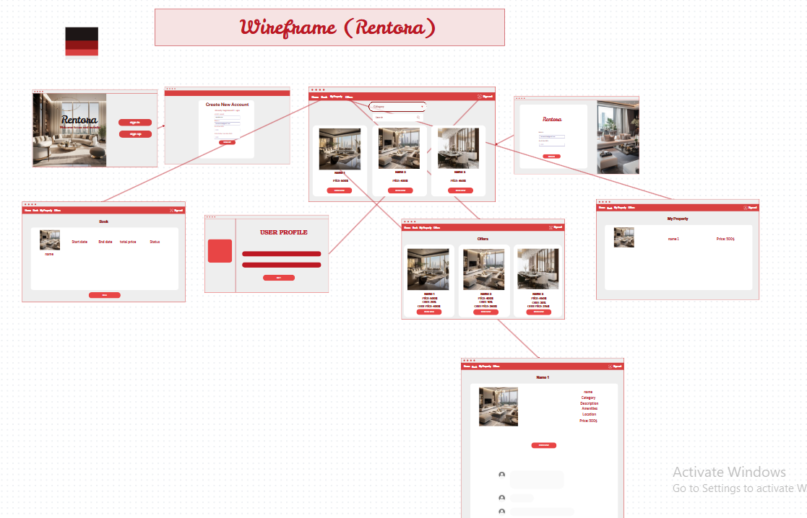

# RENT ORA

## Background:

The website serves as a dynamic platform connecting property owners and renters. Users can browse through a wide range of available properties for rent, complete with detailed descriptions and images. Property owners have the option to list their properties on the platform, making them accessible to potential renters.

Renters can select properties based on their preferred dates and view the current booking status of each property. After renting a property, users can leave reviews in the comments section, sharing their experiences with others. This comprehensive functionality ensures a seamless and interactive experience for both renters and property owners.

## User Stories

1. **View Properties**  
   As a user, I want to browse through the available properties with detailed descriptions, images, and booking statuses so that I can easily find a property that meets my needs.

2. **Add My Own Properties**  
   As a user, I want to list my own properties on the platform, including details and images, so that other users can view and rent them.

3. **Edit Profile**  
   As a user, I want to update my profile information, such as my name, password, and profile picture, so that my account reflects my current details.

4. **Add Reviews**  
   As a user, I want to leave a review for a property I have rented, so I can share my experience with other users.

5. **View Booked Properties**  
   As a user, I want to see a list of all the properties I have booked, along with the booking details, so that I can manage my reservations easily.

6. **View Property Status**  
   As a user, I want to see the current status of each property (e.g., available, booked, or under maintenance) so that I can make informed decisions while browsing.

## Entity relationship diagrams (ERD)

The data that will be utilised in an One method of describing the data that will be utilised in an application is using entity relationship diagrams, or ERDs. Based on the user stories we developed earlier, we are aware that we need to monitor users and listings. Before we look at the user-listing relationships, let's look at the information we need to monitor for each resource.

### Our ERD:

# wireframe:

## Lead page:

## SignUp:

## Home page:

## SignIn page:

## My Property:

## Offers Property:

## User Profile:

## Book:

## Details:

[wireFrame](https://www.canva.com/design/DAGcPlfYAFM/sZZUWBEjSTZsFIqC7lz64A/edit?utm_content=DAGcPlfYAFM&utm_campaign=designshare&utm_medium=link2&utm_source=sharebutton)

## Technologies Used

- **React**: JavaScript library for building user interfaces.
- **React Router**: For page navigation.
- **CSS**: For styling the app (or you can use CSS frameworks like Bootstrap or Material UI).
- **useState** and **useEffect**: For state management and handling side effects.
- **Node.js**: JavaScript runtime for building the backend server.
- **Express**: Web framework for Node.js to handle API requests and manage routes.

# Future Fetchers:

1. Payment get way
2. Integrate ai
3. Add more registration options
